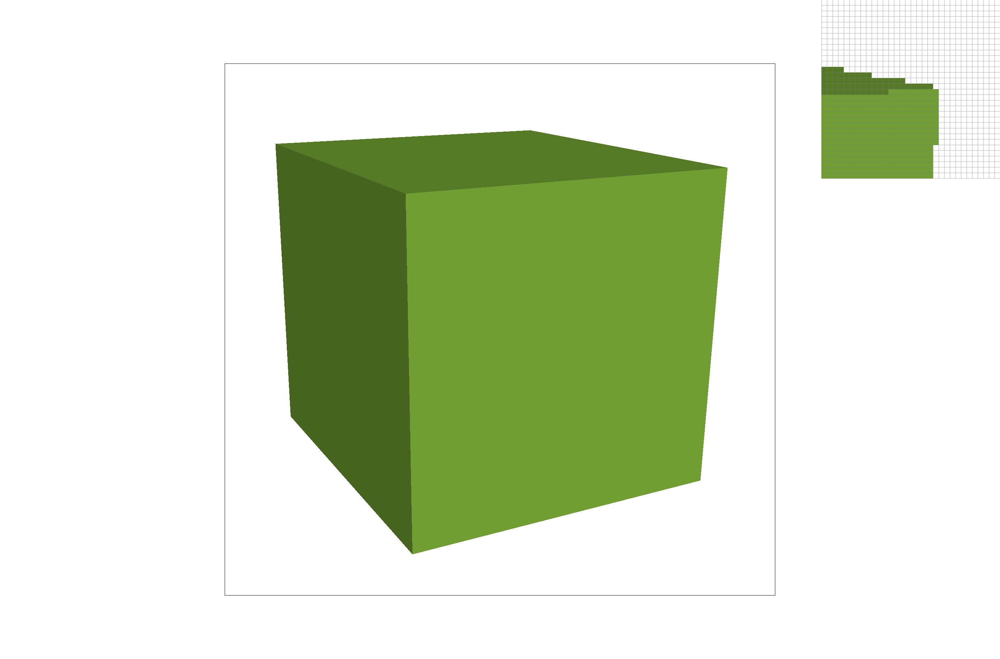
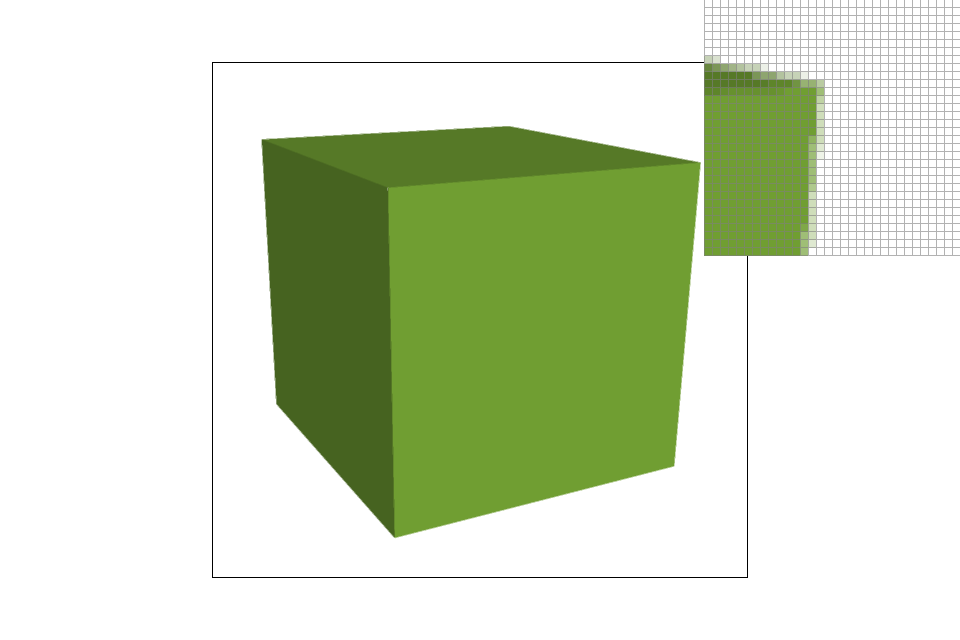

# CS 184: Computer Graphics and Imaging, Spring 2019
## Project 1: Rasterizer
### Zhiming Xu, 3034485754
### Overview
Leave this part for a while
## Section I: Rasterization
### Part 1: Rasterizing single-color triangles
- I think rasterizing a triangle is like coloring grids by sampling. Since in real world, the edges of a triangle are continuous, but on screen, they need to be converted to a finite number of grids. Therefore, when given the coordinates of endpoints of a triangle, we need to determine those vertices included in it, and give them correct colors so that they original triangle can be displayed on screen.
- My algorithm first find the min and max value of x's and y's. And only sample the grids within this range, i.e., sample all vertices included in the minimum bounding box of the triangle. Therefore, it is exactly the same as what's mentioned in the question.
- As is shown in the figure below. 

### Part 2: Antialiasing triangles
- Instead of just sampling once for each pixel, this time we need to sample muliple times for each pixel. 
  Concretely, we divide one pixel into `sample_per_side` subpixels per side, therefore, we now need to sample`sample_per_side * sample_per_side` times for one pixel. And average their values to derive its color. The reason why supersampling is useful is that it samples more pixels so that better determine to what degree a pixel belongs to
  a triangle instead of just deciding inside or not. I added subpixel sampling in previous pixel sampling. By supersampling, the pixels partially in a triangle are assigned an intermediate color between blank and full. Thus the edges look smoother.
- As are shown in the figures below.
  
  
### Part 3: Transforms
**This area needs to modify original codes, TODO later**
## Section 2: Sampling
### Part 4: Barycentric coordinates
- I think barycentric coordinates is another way to represent the location of a point within a specific triangle.
- As is shown in the figure below.

### Part 5: Pixel sampling
- Pixel sample is determine a pixel's relevant location (via barycentric coordinates) within a triangle and use the color in the same location of the texture to color this pixel. I implemented it in the following way:
    - `raterize_trianlge` has a parameter `tri`, which in this case is a pointer to `TexTri` structure, and has a virtual method `TexTri::color`.
    - We need to use this method to derive texture color, which takes in the sampled pixel's barycentric coordinates `p_bary` and `sp` which indicates sampling parameters as the only useful parameters. 
    - In `tri->color`, the weighted sum of texture triangle's endpoints' colors, i.e., `p0_col`, `p1_col`, and `p2_col`, is calculated and set as `sp.p_uv`.
    - `tri->tex->sample` is called to derive correct color by either *nearest* or *linear*, which returns the color of the nearest pixels of texture or the linear interpolation of the four nearest pixels of texture.
- Nearest: as this name suggests, substitute the sampled pixel with a texture pixel nearest to it.
- Linear: substitute the sampled pixel with the weighted linear sum of four texture pixels nearest to it.
- The four figures show: 1x nearest, 16x nearest, 1x linear, 16x linear, respectively

- I think if there is some thin part, linear method will perform better because nearest method is likely to ignore this part due to substitution with a nearby pixel. 
### Part 6: Level sampling
- Level sampling is a method in addition to pixel sampling. In order to deal with images' different sizes, we can pick the most suitable texture to sample a pixel to get better results. I implemented it by completing `get_level` method and pass it to previous pixel sampling methods according to `sp.lsm`. For `L_NEAREST`, calculate image size and use the most similar mipmap to color the pixel. For `L_LINEAR`, use the two most similar mipmap's linear interpolation to color the pixel.

   